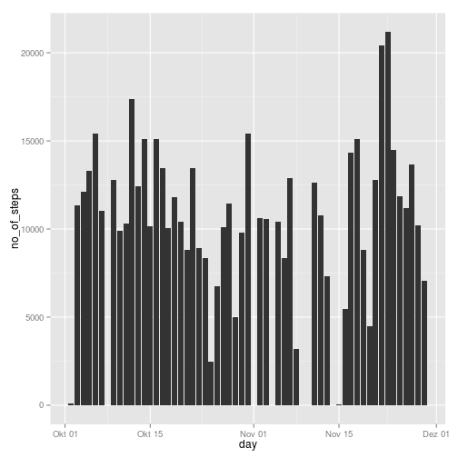
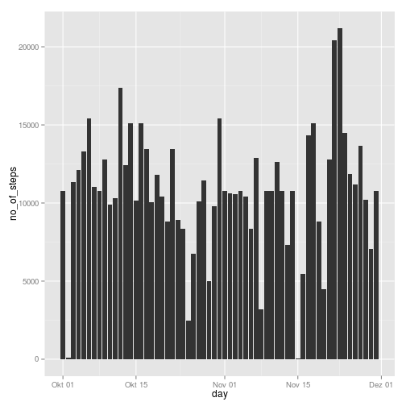
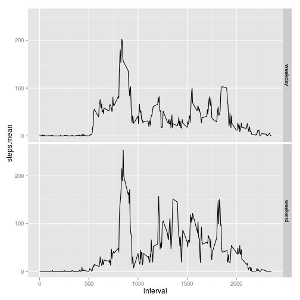

# Reproducible Research: Peer Assessment 1


## Loading and preprocessing the data

```r
# Show any code that is needed to
# 1. Load the data (i.e. read.csv())
# 2. Process/transform the data (if necessary) into a format suitable for your analysis

setwd("/home/lukasz/Documents/Coursera/5. Reproductible Research/Assignment1/github/RepData_PeerAssessment1")
unzip("activity.zip")
activity <- read.table("activity.csv", header = T, sep = ",", quote = '"' )
activity <- transform(activity, date = as.Date(date, "%Y-%m-%d"))
```

## What is mean total number of steps taken per day?


```r
# For this part of the assignment, you can ignore the missing values in the dataset.
# 1. Make a histogram of the total number of steps taken each day
# 2. Calculate and report the mean and median total number of steps taken per day

aggStepsPerDay <- aggregate(x = activity$steps, by = list(activity$date), FUN = sum)
names(aggStepsPerDay) <- c("day", "no_of_steps")
library(ggplot2)
p <- ggplot(data = aggStepsPerDay, aes(day, no_of_steps)) 
p + geom_bar(stat = "identity")
```

```
## Warning: Removed 8 rows containing missing values (position_stack).
```

 

```r
mn <- format(mean(aggStepsPerDay$no_of_steps, na.rm = T), digits=8)
md <- format(median(aggStepsPerDay$no_of_steps, na.rm = T), digits=8)
```

Mean number of steps taken per day is 10766.189 and the median is 10765.

## What is the average daily activity pattern?


```r
# 1. Make a time series plot (i.e. type = "l") of the 5-minute interval (x-axis) and the average number of steps taken, averaged across all days (y-axis)
# 2. Which 5-minute interval, on average across all the days in the dataset, contains the maximum number of steps?

aggStepsOverIntv <- aggregate(x = activity$steps, by = list(activity$interval), FUN = function(x) mean(x, na.rm = T) )
names(aggStepsOverIntv) <- c("interval", "avg_steps")
plot(x = aggStepsOverIntv$interval, y = aggStepsOverIntv$avg_steps, type = "l", xlab = "Interval", ylab = "Average number of steps")
```

 

```r
sel <- max(aggStepsOverIntv$avg_steps) == aggStepsOverIntv$avg_steps
interval.with.highest.avg.steps <- aggStepsOverIntv[sel, c("interval")]
interval.with.highest.avg.steps
```

```
## [1] 835
```

Interval 835 has the highest average number of steps.

## Imputing missing values


```r
# Note that there are a number of days/intervals where there are missing values (coded as NA). The presence of missing days may introduce bias into some calculations or summaries of the data.
# 1. Calculate and report the total number of missing values in the dataset (i.e. the total number of rows with NAs)
# 2. Devise a strategy for filling in all of the missing values in the dataset. The strategy does not need to be sophisticated. For example, you could use the mean/median for that day, or the mean for that 5-minute interval, etc.
# 3. Create a new dataset that is equal to the original dataset but with the missing data filled in.
# 4. Make a histogram of the total number of steps taken each day and Calculate and report the mean and median total number of steps taken per day. Do these values differ from the estimates from the first part of the assignment? What is the impact of imputing missing data on the estimates of the total daily number of steps?

missing.rows <- nrow(activity[is.na(activity$steps) | is.na(activity$date) | is.na(activity$interval), ])
```

Total number of of rows with missing values is 2304. 


```r
# calculate average number of steps per interval
activity$mean.steps.over.intv <- ave(activity$steps, activity$interval, FUN=function(x) mean(x, na.rm = T))

# replace NA's with average number of steps per interval
activity.clean <- data.frame(steps = ifelse(is.na(activity$steps), activity$mean.steps.over.intv, activity$steps), date = activity$date, interval = activity$interval)

aggStepsPerDay.clean <- aggregate(x = activity.clean$steps, by = list(activity.clean$date), FUN = sum)
names(aggStepsPerDay.clean) <- c("day", "no_of_steps")

library(ggplot2)
p <- ggplot(data = aggStepsPerDay.clean, aes(day, no_of_steps)) 
p + geom_bar(stat = "identity")
```

 

```r
mn.clean <- format(mean(aggStepsPerDay.clean$no_of_steps, na.rm = T), digits=8)
md.clean <- format(median(aggStepsPerDay.clean$no_of_steps, na.rm = T), digits=8)
```

In the clean dataset nean number of steps taken per day is 10766.189 and. the median is 10766.189 which is different from the dataset with NA's. 
Total daily number of steps calculated on clean dataset is higher that the value calculated for dataset with missing values.


## Are there differences in activity patterns between weekdays and weekends?


```r
# For this part the weekdays() function may be of some help here. Use the dataset with the filled-in missing values for this part.
# 1. Create a new factor variable in the dataset with two levels – “weekday” and “weekend” indicating whether a given date is a weekday or weekend day.
# 2. Make a panel plot containing a time series plot (i.e. type = "l") of the 5-minute interval (x-axis) and the average number of steps taken, averaged across all weekday days or weekend days (y-axis). The plot should look something like the following, which was creating using simulated data:

activity.clean <- transform(activity.clean, wd.wkd = ifelse(format(date, "%w") %in% c("5", "6"), "weekend", "weekday") )

aggStepsPerDayType.clean <- aggregate(x = activity.clean$steps, by = list(activity.clean$interval, activity.clean$wd.wkd), FUN = mean)
names(aggStepsPerDayType.clean) <- c("interval", "day.type", "steps.mean")

qplot(interval, steps.mean, data=aggStepsPerDayType.clean, facets=day.type~., geom = "line")
```

 
